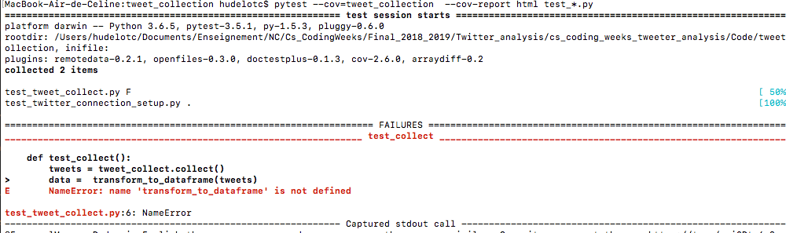
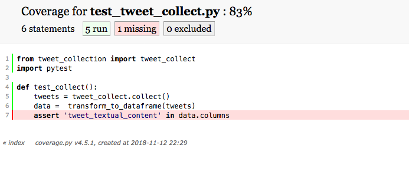

# Fonctionnalité 2 : Un utilitaire d'accès aux données du corpus.

Pour pouvoir manipuler correctement l'information contenue dans le corpus, il est nécessaire de programmer un ensemble d'outils permettant de récupérer l'information utile. Nous allons pour cela créer un module `corpusutils` à l'intérieur du projet `datavisualization.`  Nous vous rappelons que la bonne manière pour faire cela est d'ajouter un fichier `__init.py__` vide à la racine du répertoire `datavisualization`. Si vous ne maitrisez pas très bien cette notion de modules et packages, nous vous invitons à consulter le tutorial du début [ici](https://github.com/hudelotc/CentraleSupelec_CodingWeeks_2020/blob/main/modulespackagespython.md) ou cette [documentation](https://chrisyeh96.github.io/2017/08/08/definitive-guide-python-imports.html).

Nous allons constuire ce module `corpusutils` par itérations.


## Itération 1 : un lecteur d'annotation brat.

Pour pouvoir récupérer l'information contenue dans les annotations, il est nécéssaire de pouvoir parser les fichiers `.ann`. Votre premier travail consiste donc à créer un lecteur de fichiers `.ann`. Ce lecteur sera implémenté dans une fonction `read_and_load_ann_annotation(filename)` qui, étant donné le chemin `filename` d'un fichier d'annotation, ouvre ce fichier et renvoie l'information utile sous la forme d'un dictionnaire python `dict`. 

Pour comprendre ces annotations, regardons par exemple le tweet d'ID `143048389142134785` dont le contenu textuel est le suivant :

```
Ce soir c'est l'élection de #missfrance et je vais me faire un plaisir de NE PAS regarder.
```
L'annotation correspondante donnée dans le fichier `143048389142134785.ann` est : 

```
R1	Negates Arg1:T3 Arg2:T2	
R2	isNegativeOpinionOn Arg1:T2 Arg2:T1	
T2	Subjectiveme_positive 63 70	plaisir
T3	Negator 77 80	PAS
T1	Topic 16 39	élection de #missfrance
```

**Comment lire et comprendre ce fichier?**

Cette annotation indique que le sujet (`Topic`) de ce texte est `élection de #missfrance`. Cette information est présente dans le texte du tweet à partir du caractère `16` et jusqu'au caractère `39`. Le tweet contient aussi un indicateur de négation `PAS` qui se trouve entre les caractères `77` et `80` du texte et un indicateur de *positivité*, le mot `plaisir` qui se trouve entre les caractères `63` et `70` du texte. L'annotation donne ensuite comme information que dans le tweet, une information négative est donnée (la ligne R2 de l'annotation se lit comme `plaisir` est une opinion négative de `élection de #missfrance`) et qu'il faut considérer `NE plaisir` dans ce tweet et non pas `plaisir` (ligne R1 de l'annotation).

Cet exemple montre toute la richesse des annotations au format [brat](http://brat.nlplab.org/standoff.html). Dans ce projet, nous n'utiliserons pas toute cette information, en tout cas pas pour le MVP. 

Pour un tweet donné, nous voulons avoir :

+ L'ensemble des sujets qu'il traite (entité de type `Topic`)
+ Pour chaque sujet, si l'opinion est positive ou négative à son propos.
+ L'ensemble des mots clés considérés comme positifs dans le tweet.
+ L'ensemble des mots clés considérés comme négatifs dans le tweet.


Par exemple, pour l'annotation ci-dessus, nous aimerions récupérer l'information utile sous cette forme (dictionnaire python).

```PYTHON
{'topics': [{'name': 'élection de #missfrance', 'opinion': 'negative'}], 'negative_keywords': ['pas plaisir'], 'positive_keywords': ['plaisir']}
```

Voici un autre exemple :

```
T1	Topic 9 18	Languedoc
T3	Subjectiveme_positive 30 35	jolie
R2	isPositiveOpinionOn Arg1:T3 Arg2:T1	
T5	Topic 71 89	Nord-Pas-De-Calais
T2	Negator 49 52	pas
T4	Subjectiveme_positive 44 48	aime
R1	Negates Arg1:T2 Arg2:T4	
R3	isNegativeOpinionOn Arg1:T4 Arg2:T5
```

Et le dictionnaire associé :

```PYTHON
{'topics': [{'name': 'Languedoc', 'opinion': 'positive'}, {'name': 'Nord-Pas-De-Calais', 'opinicon': 'negative'}], 'negative_keywords': ['pas aime'], 'positive_keywords': ['jolie', 'aime']}

```

On perd bien entendu de l'information en faisant cela mais cela suffira pour la mise en place de notre MVP.


Pour écrire ce lecteur d'annotation, nous allons utiliser l'approche de développement [**TDD (Test Driven Development)**](https://fr.wikipedia.org/wiki/Test_driven_development) qui consiste à spécifier le comportement attendu via un test avant de l’implémenter effectivement (c'est ce que nous venons typiquement de faire).


Le principe est donc d'écrire en premier lieu le test et ensuite le code le plus simple possible qui permette au test de passer et donc de satisfaire le comportement spécifié. Le code peut ensuite être amélioré. L'idée est donc de se focaliser sur les fonctionnalités plutôt que sur le code.

Nous allons d'abord travailler pas à pas puis vous prendrez au fur et à mesure de l'autonomie sur cette approche. 

1. **Critères d'acceptance.**

 Un des premières tâches à faire ici est de rechercher et de lister l'ensemble des critères qui permettront de répondre correctement aux besoins que la fonctionnalité *Parser une annotation ann* est sensée couvrir. Ces critères sont des **critères d'acceptance**. Ici, c'est très simple, le critère d'acceptance de *Parser une annotation ann* est d'**avoir en sortie un dictionnaire contenant l'information utile**.
 
 
 
 
 2. **Developpement en mode TDD**

 Le **TDD (Test Driven Development)** est un développement dirigé par les tests et donc la première ligne de votre programme doit être dans un fichier de tests. Dans notre cas, nous utiliserons le module [`pytest`](https://docs.pytest.org/en/latest/) qu'il faut donc ajouter à votre projet. Le principe du TDD repose sur 3 étapes complémentaires.
 
   + Première étape (**<span style='color:red'>RED</span>**) : Ecrire un premier test qui échoue.
   + Deuxième étape (**<span style='color:green'>GREEN</span>**) : Ecrire le code le plus simple qui permet de passer le code.
   + Troisième étape (**REFACTOR**) : Améliorer le code source.


Nous allons donc appliquer cette méthode à la fonctionnalité de parsing du fichier ann


#### **<span style='color:red'> ETAPE RED</span>**

Notre premier test va consister à tester que le parsing renvoie bien un dictionnaire bien fondé lors de la lecture d'un fichier ann.

```PYTHON
from datavisualization.corpusutils import read_and_load_annotation
from pytest import *


def test_read_and_load_annotation():
    # Given
    filename = "143048389142134785.ann"
    # When
    annotations = read_and_load_annotation(filename)
    #Then
    assert annotations = {'topics' : [{ 'name' : "élection de #missfrance", 'opinion':'negative' }], 'negative_keywords': ["pas plaisir"], 'positive_keywords':["plaisir"]}
    # Given
    filename1 = "143059118180139008.ann"
    # When
    annotations1 = read_and_load_annotation(filename1)
    #Then
    assert annotations1 = {'topics' : [{ 'name' : "Languedoc", 'opinion':'positive' },{ 'name' : "Nord-Pas-De-Calais", 'opinicon':'negative' } ], 'negative_keywords': ["pas aime"], 'positive_keywords':["jolie", "aime"]}


```

Recopier ce code dans un fichier `test_read_and_load_annotation.py`.
Ce test doit échouer, puisqu'en l'état actuel du projet, le code pour `read_and_load_annotation` n'existe pas et on a donc une erreur lors de l'exécution du code.

#### **<span style='color:green'> ETAPE GREEN</span>**

On va maintenant écrire le code qui permet de faire passer ce test le plus rapidement possible.

Il suffit pour cela de :

 + Créer et compléter une fonction `read_and_load_annotation(filename)` dans le fichier `corpusutils.py` de telle manière que le test précédent passe.
 
Votre test devrait passer au vert avec cette étape **<span style='color:green'> ETAPE GREEN</span>**
 

#### **<span style='color:black'> ETAPE REFACTOR</span>**
   
La dernière étape consiste en une étape de [refactoring](https://refactoring.com/), à mettre en place si nécessaire.   

Le [refactoring](https://en.wikipedia.org/wiki/Code_refactoring)(ou réusinage de code) est un principe de programmation qui consiste à changer la structure interne d’un logiciel sans en changer son comportement observable. C'est une étape qui doit toujours être exécutée quand les différents tests sont au vert et qui n'est pas obligatoire. Elle doit surtout permettre d'améliorer la **qualité du code** par exemple en améliorant :
 
 + **la conception** : découpage en fonctions, modules ou classes afin de rendre votre code le plus simple possible.
 + **la lisibilité du code** : il faut ici prendre le temps d'appliquer les principes du [clean code](https://cleancoders.com/cart) introduit par Robert C. Martin dans l'ouvrage du même nom et dont un des principes est celui des boy-scouts (*« The Boy Scout Rule »*): *« Toujours laisser un endroit dans un état meilleur que celui où vous l’avez trouvé »*.
 
Dans notre cas, un des premiers principes est de vérifier du bon nommage (variables, fonctions, packages, classes et cie) et de la présence de commentaires dans notre code. 
 
 Vous trouverez [ici](https://github.com/zedr/clean-code-python#objects-and-data-structures) quelques principes du clean code transposé au langage python. Prenez le temps de lire rapidement ce site et appliquer ces différents principes au code que vous allez écrire.
 
Dans cette étape **<span style='color:black'> ETAPE REFACTOR</span>**, on peut aussi travailler à l'optimisation des performances du programme si cela s'avère vraiment nécessaire.
 
 
#### **ATTENTION**

1. **Après cette étape, n'oubliez pas de relancer les tests pour vérifier que le comportement de votre code n'a pas changé et que tout est encore bien AU VERT !**

2. On vient ici de terminer la réalisation de l'étape *un lecteur d'annotation brat* et il convient donc de **committer ce changement dans votre gestionnaire de version avec un message de commit explicite reprenant l'objectif de l'étape**. Pensez aussi à mettre à jour votre dépôt distant.
 
 
Dans la suite, nous vous conseillons d'utiliser l'approche TDD mais ce n'est pas obligatoire. Il faudra cependant toujours prendre soin **de tester vos programmes**.
 
 
 

## Itération 2: Associer un tweet à une annotation


Pour un tweet donné du corpus, il faut vérifier qu'une annotation est disponible dans le corpus et il faut pouvoir récupérer et stocker cette information dans une structure de données qui va pouvoir faciliter leur traitement. Nous utiliserons ici un dictionnaire python `dict` qui contiendra donc les clés suivantes :

+ `"id"`: l'identifiant du tweet
+ `"text"` : le texte du tweet
+ `"annotation"`: l'annotation du tweet telle qu'obtenue dans l'étape précédente.

Ecrivez et testez la fonction `load_tweet_with_annotation (id)` qui étant donné l'`id` d'un tweet construit un tel dictionnaire. On prendra bien soin de tester cette fonction et de gérer le cas où un tweet n'a pas d'annotation. Il faut aussi le faire avec l'approche TDD.

#### <span style="color: #26B260">A ce stade du projet, vous avez atteint le JALON 3 : Ecrire du code dans une démarche TDD </span> 


## A propos de la couverture de code par vos tests

Une couverture de code par les tests (code coverage) nous permet de connaître le pourcentage de notre code qui est testé et donc cela permet d'avoir une idée de ce qui reste d'ombre dans notre projet.

En règle générale, on considère qu'une couverture de code supérieure à 80% est signe d'un projet bien testé et il sera alors plus facile de rajouter de nouvelles fonctionnalités à ce projet.

Pour connaître le taux de couverture par les tests de votre projet, vous pouvez utiliser des bibliothèques python [`coverage`] et [`pytest_cov`] qu'il faut donc installer


`pip3 install coverage` ou `pip install coverage`

`pip3 install pytest-cov` ou `pip install pytest-cov`


Il faut ensuite vous placer dans le répertoire de votre projet et lancer la commande suivante :

`pytest --cov=datavisualization --cov-report html test_*.py`

Cette commande permet de tester les fichiers contenus dans le dossier `datavisualization`. Elle crée un rapport en html et le place dans le répertoire `htmlcov` et utilise les tests qui sont dans ce répertoire et qui sont de la forme `test_[caracteres].py`.

L'ouverture du fichier `index.html`dans le répertoire `htmlcov`vous permet de visualiser un bilan du test de couverture qui devrait être bon dans la mesure où nous avons utilisé l'approche TDD. Un clic sur chacun des fichiers permet aussi d'avoir un bilan propre à chaque fichier comme illustré sur les images ci-dessous (et qui montre le résultat pour un autre projet).







#### <span style="color: #26B260">A ce stade du projet, vous avez atteint le JALON 5 : une première couverture de mon projet par des tests </span> 


## A propos de la gestion des versions

<span style='color:blue'> Pour toute la suite du projet, il vous est demandé de :</span> 

+ <span style='color:blue'>Faire un commit dès que la réalisation d'une fonctionnalité ou d'une sous-fonctionnalité est finie.</span> 
+ <span style='color:blue'>Tagger à la fin de chaque journée votre dernier commit </span> 
+ <span style='color:blue'>De faire une revue de code au sein de l'équipe pour chaque fonctionnalité.</span>
+ <span style='color:blue'>De mettre le code stable sur la branche `master`.</span>
+ <span style='color:blue'>Pousser (Push) le code vers votre dépôt distant sur GitLab.</span> 
+ <span style='color:blue'>Faire un test de couverture de code à la fin de chaque journée et de pousser le bilan obtenu vers votre dépôt distant sur GitLab.</span>


vous pouvez maintenant passer à la [**Fonctionnalité 3** : Prise en main de `pandas`.](./S1_pandas.md)


