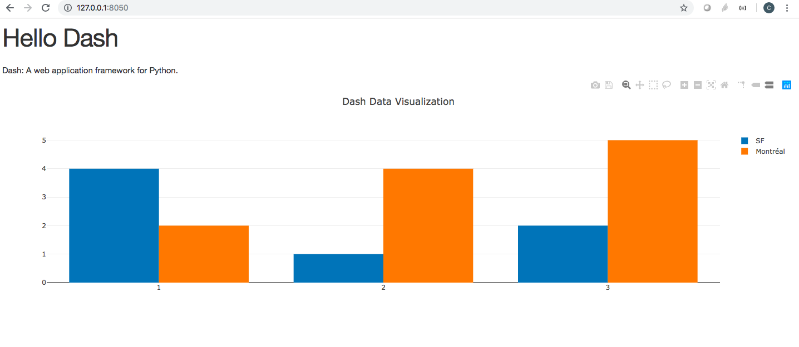

# Fonctionnalité 11 : Votre première application avec Dash


[Dash](https://plot.ly/) est un framework pour prototyper rapidement des applications web de visualisation.

## Etape 1 : Installer Dash.

Pour l'installer il faut taper les commandes ci-dessous:


```
pip install dash==1.17.0  

```


## Etape 2 : Créer un Dash Layout


Une application Dash est composée de deux parties. La première partie est le  **layout** de l'application et elle décrit à quoi ressemble l'application. La deuxième décrit les interactions avec l'application.

Pour créer votre première application Dash, nous allons suivre le manuel du site qui se trouve [ici](https://dash.plotly.com/layout).

Si vous recopiez et executez le code donné dans ce tutorial, vous allez obtenir cette visualisation à l'adresse mentionnée lors de l' execution, ici `http://127.0.0.1:8050/`.





C'est une application interactive. Essayez de passer votre souris dessus.
Regardez bien les différents types de graphes ou de visualisation proposées par DASH en prenant le temps de regarder le [tutoriel](https://dash.plotly.com/)).


## Etape 3 : Créer un dash layout pour l'analyse d'opinions.

L'objectif maintenant est de créer, avec `dash`, un layout pour votre application d'analyse d'opinions. C'est une étape ouverte qui  nécessitera très certainement d'adapter un des exemples donnés dans le tutorial de dash à votre application.


Nous allons maintenant utiliser une dernière représentation sous forme de nuage de mots pour afficher le vocabulaire de nos tweets. Il s'agit de la fonctionnalité : [**Fonctionnalité 13** : Prise en main de WordCloud](./S7_wordcloud.md)


