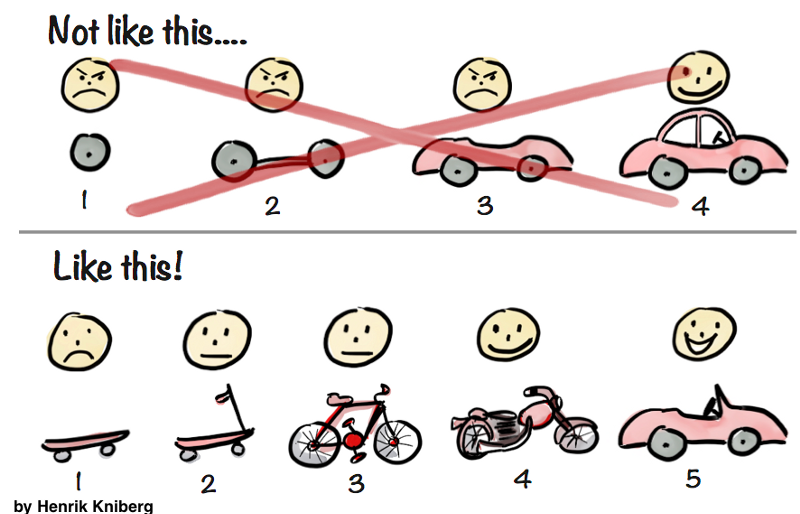

# Programmez une application d'analyse de données et de visualisation de données avec l'écosystème python.

L'**objectif** de ce mini-projet est de développer, de manière très incrémentale, une application d'analyse et de visualisation de données avec l'écosystème python. En particulier, nous allons travailler sur une application d'analyse d'émotions et une visualisation de cette dernière dans un corpus de tweets français, le corpus [Canephore](https://github.com/ressources-tal/canephore).

L'objectif pourrait être par exemple d'arriver à une visualisation de ce corpus sous la forme d'un dashboard de ce type :

Au travers de ce projet, vous découvrirez l'écosystème python pour la science des données mais aussi plusieurs principes du mouvement dit du [*Software Craftmanship*](https://www.octo.com/fr/publications/20-culture-code). 

## Organisation du mini-projet

Ce mini-projet est découpé en plusieurs objectifs, eux-mêmes découpés en  **sprints** et **fonctionnalités**. La notion de sprint fait référence à la [méthode agile](https://fr.wikipedia.org/wiki/M%C3%A9thode_agile). Un sprint correspond à un intervalle de temps pendant lequel l’équipe projet va compléter un certain nombre de tâches.

Ce travail de découpage a été fait pour vous pour ce projet mais c'est une des premières étapes à faire pour tout projet de développement logiciel, au moins de manière macroscopique. Pensez-y la semaine prochaine !

### **Objectif 1 (MVP): Une première visualisation du corpus avec `matplotlib`** 

L'objectif des deux premières journées est de construire et d'implémenter une version simple de l'outil d'analyse et de visualisation de tweets que l'on pourrait qualifier de **[MVP (Minimum Viable product)](https://medium.com/creative-wallonia-engine/un-mvp-nest-pas-une-version-simplifi%C3%A9e-de-votre-produit-89017ac748b0)**. 

Ce concept de MVP a été popularisé par Eric Ries, l'auteur de [The Lean Startup](http://theleanstartup.com/), une approche spécifique de démarrage d'une activité économique et de lancement d'un produit. La figure ci-dessous permet de bien expliquer ce concept.

 + **Sprint 0** :
	 + [Installation du socle technique.](./Sprint0Installbis.md)
	 + [Analyse des besoins.](./Sprint0Analyse.md) 
	 + [Refexion autour de la conception.](./Sprint0Conception.md)

 + **Sprint 1 : Récupération et structuration des données**
 
 	+ [**Fonctionnalité 1** : Prise en main du corpus Canephore.](./S1_corpuspriseenmain.md)
 	+ [**Fonctionnalité 2** : Un utilitaire d'accès aux données.](./S1_canephoredataacess.md)
 	+ [**Fonctionnalité 3** : Prise en main de la bibliothèque `pandas`.](./S1_pandas.md)
 		
 + **Sprint 2** : **Visualisation des statistiques du corpus**
 	+ [**Fonctionnalité 4** : Statistiques sur le corpus](./S2_statistics.md)
 	+ [**Fonctionnalité 5** : Visualisation des statistiques sur le corpus.](./S2_visu.md)

 + **Sprint 3** : **Finalisation du MVP**
 	+ [**Fonctionnalité 6** : Un programme principal](./S3_main.md)
 	+ [**Fonctionnalité 7** : Une interface en ligne de commande avec `argparse`.](./S3_argparse.md)
 	 	

### Objectif 2 : Analyse et Visualisation plus avancée des résultats de l'analyse (Amélioration du MVP) 

 + **Sprint 4** : **Ajout de l'analyse automatique de l'opinion avec [Textblob](https://textblob.readthedocs.io/en/dev/)**

 	+ [**Fonctionnalité 8** : Prise en main de `Textblob`](./S4_textblob.md)
 	+ [**Fonctionnalité 9** : Analyse de l'opinion](./S4_opinion.md)

+ **Sprint 5** : **Visualisation simple de l'analyse avec [`seaborn`](https://seaborn.pydata.org/)**	

 	+ [**Fonctionnalité 10** : Afficher le résultat de l'analyse avec `seaborn`.](./S5_displayresult.md)
 	

### Objectif 3 : Visualisation plus avancée des résultats de l'analyse (Amélioration du MVP)

+  **Sprint 5** : **Une application de visualisation avec [Dash](https://plot.ly/)**
	+ [**Fonctionnalité 11** : Votre première application avec PlotLy](./S6_dash.md) 

+  **Sprint 6** : **Nuage de mots avec [`WordCloud`](https://github.com/amueller/word_cloud)!** 
	+ [**Fonctionnalité 12** : Prise en main de `WordCloud`](./S7_wordcloud.md)
	+ [**Fonctionnalité 13** : `WordCloud` sur votre ensemble de tweets](./S7_wordcloudtweet.md)

### Objectif 4 : Ajout de l'analyse des sentiments par apprentissage 

Il s'agit ici d'un travail supplémentaire mais qui va au délà des objectifs de la première semaine des coding weeks.

Typiquement ici, pour ne pas être dépendant par exemple de bibliothèques d'analyse du contenu comme `textblob` ou `spacy, vous pourriez vouloir dévélopper votre propre outil de prédiction de l'opinion d'un tweet. 

Comme nous disposons du corpus `canephore` qui est annoté, nous pourrions alors mettre en oeuvre une chaîne d'apprentissage supervisé à l'aide de la bibliothèque `scikit-learn`. 

Nous allons donc nous intéresser à ces deux dernières fonctionnalités :

+ [**Fonctionnalité 14** : Mise en place d'une chaîne d'apprentissage supervisé](./S7_learning.md)
+ [**Fonctionnalité 15** : Récupération de tweets - Mise en place d'un outil de collecte](./S1_twitter_connect.md)

 

 

