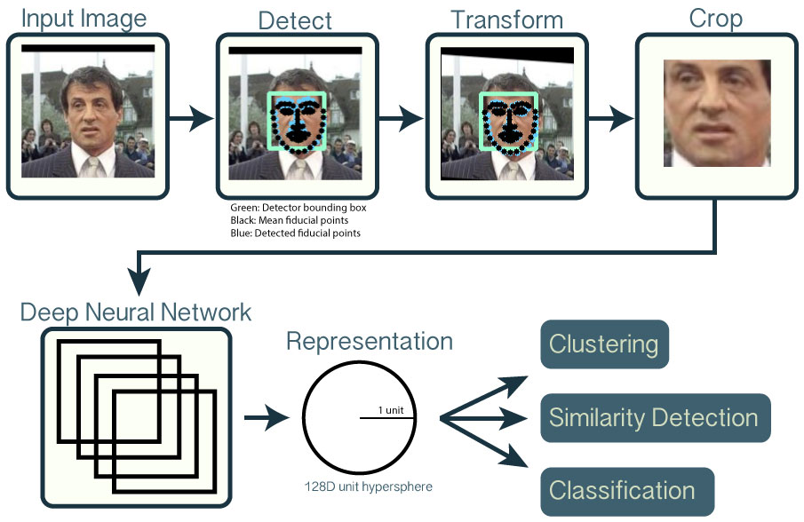

# Fonctionnalité 3 : Création d'un module d'utilitaires de manipulation d'images pour la reconnaissance de visages.

Pour la reconnaissance de visages, nous nous baserons sur des modèles d'apprentissage profond et plus particulièrement sur l'approche présentée dans le projet [OpenFace](https://cmusatyalab.github.io/openface/) dont le principe est schématisé ci-dessous.

En particulier, étant donnée une image d'entrée, la reconnaissance de visages implique :

+ une étape de **détection** qui permet de sélectionner la zone de l'image correspondant au visage.
+ une étape de **transformation** permettant de découper et déformer le visage pour être recentré et réaligné par rapport à l’image 
+ une étape de **représentation** qui permet de représenter chaque image de visage ainsi constituée par un vecteur de taille 128 qui quantifie l'information utile.
+ puis, sur la base de cette description, on cherche à qui appartient le visage en comparant avec des images de personnes connues dans une base de données.

Les approches d'apprentissage profond ont montré être très performantes pour chacune de ces étapes.

Pour mettre en place ces différentes étapes, un certain nombre d'utilitaires peuvent être utiles comme par exemple :
 
 + la conversion colorimétrique d'images notamment pour tranformer une image couleur en image en niveau de gris ou pour changer l'espace couleur utilisée (par exemple : BGR à RGB ou autre). Voir les [fonctionnalités d'OpenCV](https://opencv24-python-tutorials.readthedocs.io/en/latest/py_tutorials/py_imgproc/py_colorspaces/py_colorspaces.html)
 + le redimensionnement d'images : en effet, il est souvent nécessaire de disposer d'images de même dimension en entrée des réseaux de neurones profonds.
 + des opérations de type GUI pour pouvoir tracer des bounding box sur des images et d'y associer un label textuel.

 
Il s'agit donc ici de compléter le package `utils_cv` et d'eventuellement le réorganiser un peu pour lui associer un ensemble de modules ou de fonctions que vous pensez être intéressants pour la reconnaissance de visages. En particulier l'intérêt de ce travail est de pouvoir utiliser plus facilement les différentes fonctions proposées par la bibliothèque OpenCV et dont nous avons besoin. Vous pouvez par exemple pour comprendre ce qui vous est demandé regarder le package [`imutils`](https://github.com/jrosebr1/imutils) conçu avec cet objectif. Vous pourriez bien-sûr utiliser ce package mais ici le travail est de réfléchir à la conception d'un tel module, pour votre projet, dans le cas ou celui-ci ne serait pas disponible. Ce package pourra bien-sur être complété au fur et à mesure de l'avancement du projet et il faut donc réflechir à sa modularité.

Une fois terminé, n'oubliez pas de faire l'ensemble des actions de synchronisations.

Cette fonctionnalité termine le **Sprint 1 :  Prise en main d'OpenCV.**

#### :white_check_mark: A ce stade du projet, vous avez atteint le JALON 6 : un premier sprint complet de développement logiciel en groupe  

Nous pouvons maintenant au Sprint 2 et donc à la fonctionnalité [**Fonctionnalité 4** : Structuration et constitution de la base de données](./Facerecognition_S2_database.md) 

