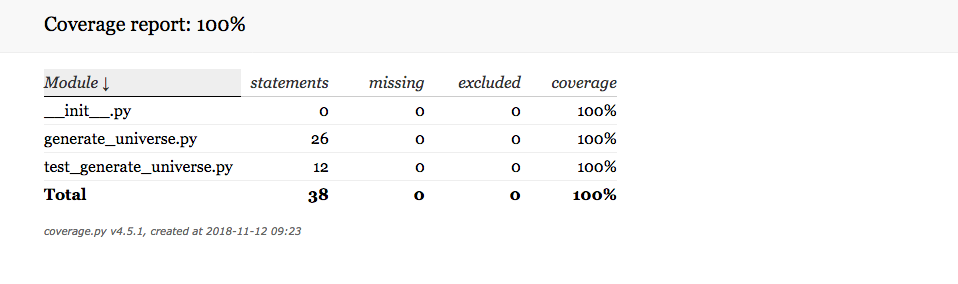
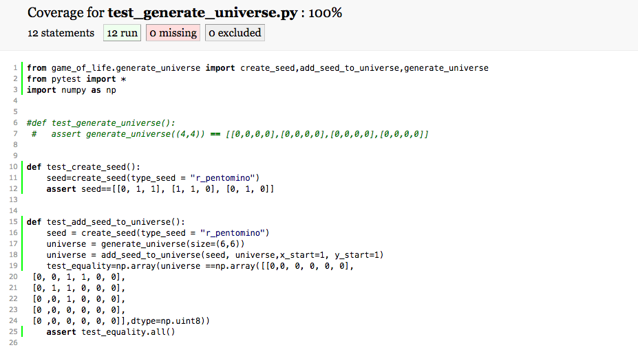

# Fonctionnalité 2 : Effectuer un traitement sur une image et afficher le résultat du traitement


Nous allons maintenant, pour prendre en main OpenCV effectuer quelques traitements classiques et disponibles dans la bibliothèque OpenCV.

Avant cela, juste quelques informations utiles sur l'objet image que nous manipulons.


Les images sont des matrices qui se composent de **pixels**. Une image est donc une grille de pixels. Une image **640 x 480** comporte donc 640 colonnes (**la largeur**) et 480 lignes (**la hauteur**).

On distingue les images en niveaux de gris des images couleur.

Chaque pixel d'une **image en niveaux de gris** a une valeur représentant l'intensité lumineuse. En règle générale, on considère qu'il y a 256 niveaux de gris - de 0 à 255. 

Les pixels d'une **image couleur** contiennent des informations supplémentaires. Nous considérons ici l'espace couleur le plus classique, l'espace RVB. A chaque pixel d'une image couleur n'est plus associée une seule valeur mais un 3-tuple, correspondant aux 3 canaux couleur. Dans openCV, à chaque pixel est associé le tuple : (B, G, R) . (B: bleu, G : vert, R: rouge).

Chaque valeur de ce 3-tuple a une plage de valeurs dans [0, 255] pour un encodage de type `uint8`. C'est le plus classique et c'est donc celui que l'on considèrera dans notre cas.  

Le code suivant qu'il vous faudra reproduire donne un exemple d'opérations de base utiles pour manipuler une image :

 + La récupération de la taille de l'image
 + La récupération de la valeur d'un pixel à une position donnée
 + La sélection d'une région donnée dans une image

 
 
```PYTHON

image = load("../Data/tetris_blocks.png")
# Affichage de la taille de l'image
(h, w, d) = image.shape
print("width={}, height={}, depth={}".format(w, h, d))
# Récupération et affichade de la valeur d'un pixel à une position donnée
(B, G, R) = image[100, 50]
print("R={}, G={}, B={}".format(R, G, B))
# extraction d'une zone d'interêt de taille 100x100 à partir de la position x=320,y=60
roi = image[60:160, 320:420]
# affichage de la région d'intérêt
cv2.imshow("ROI", roi)
cv2.waitKey(0)   


```


Nous allons maintenant nous intéresser à la fonctionnalité 2, c'est à dire une fonctionnalité qui permet, pour une image donnée, de choisir un traitement à effectuer sur cette image et de l'appliquer. On considèrera ici que l'on dispose d'une liste de traitements disponibles et que l'image sur laquelle nous voulons appliquer les traitements et le choix du traitement seront des arguments que l'on passera en ligne de commande. Cela nous permettra notamment de prendre connaissance du module [`argparse`](https://docs.python.org/3/library/argparse.html#module-argparse) de python qui est très utile.


En particulier, on pourra choisir entre :

 + Une opération de redimensionnement de son image en prenant en compte ou non le ratio d'aspect (appel à la fonction [`resize`](https://opencv24-python-tutorials.readthedocs.io/en/latest/py_tutorials/py_imgproc/py_geometric_transformations/py_geometric_transformations.html#scaling) d'OpenCV
 + Une transformation géométrique comme par exemple une rotation de l'image (appel aux fonctions [`getRotationMatrix2D`](https://opencv24-python-tutorials.readthedocs.io/en/latest/py_tutorials/py_imgproc/py_geometric_transformations/py_geometric_transformations.html#rotation) et `warpAffine` d'OpenCV).
 + Une transformation de type filtrage ou lissage comme l'application d'un filtre gaussien sur une image (appel à la fonction [`GaussianBlur`](https://opencv24-python-tutorials.readthedocs.io/en/latest/py_tutorials/py_imgproc/py_filtering/py_filtering.html#gaussian-filtering) d'OpenCV)
 + Une  opération qui consiste à dessiner un rectangle autour d'une zone d'intérêt dans une image (appel à la fonction [`rectangle`](https://opencv24-python-tutorials.readthedocs.io/en/latest/py_tutorials/py_gui/py_drawing_functions/py_drawing_functions.html#drawing-rectangle) d'OpenCV)


Pour l'écriture de cette fonctionnalité vous allez donc procéder par itération en appliquant la démarche TDD expliquée précédemment. L'ensemble des opérations seront implémentées dans un module `image_processing_operations` qu'il faudra donc ajouter au package `utils_cv` (ajout d'un fichier `image_processing_operations.py` au package). 

Dans la démarche TDD on commencera donc à compléter un fichier `test_image_processing_operations.py`. 


## Itération 1 : Appliquer un redimensionnement à une image.

Dans une démarche TDD, chaque itération commence par un test qui échoue mais qui est écrit uniquement s'il apporte un nouveau comportement au système.
Ici, il s'agit de redimensionner l'image donc un test possible est **l'image traitée a bien la dimension souhaitée** donc un code possible est donné ci-dessous pour le test 


```PYTHON

def test_resize_image():
    # given 
    img = load("../Data/tetris_blocks.png")
    (h, w, d) = img.shape
    new_dim = (200, 200)
    # when
    resized_image = resize_image(img,new_dim)
    # then 
    assert resized_image.shape == (new_dim[0],new_dim[1],d)
    
```

Ce test correspond à l'étape ETAPE RED. Il vous est demandé de faire les deux autres étapes du cycle TDD pour passer ces tests en vert et donc coder la fonctionnalité souhaitée.


## Itération 2 : Appliquer une rotation à une image.

Ici comme il est plus difficile de tester cette fonctionnalité, vous pourrez vous contenter de tester que l'image résultant de la tranformation est différente ou non selon le paramétrage de la rotation.

```PYTHON
def test_rotate_image():
    # given 
    img = load("../Data/tetris_blocks.png")
    degree = 360
    # when
    rotated_image = rotate_image(img,degree)
    # then
    assert np.array_equal(img,rotated_image)==True
    # given 
    degree = 45
    # when
    rotated_image = rotate_image(img,degree)
    # then
    assert np.array_equal(img,rotated_image)==False
```

Ecrivez la fonction `rotate_image` dans le fichier `image_processing_operations.py` de telle sorte que le test ci-dessous passe au vert.


## Itération 3 : Appliquer une transformation de type lissage ou filtrage

Appliquer la démarche précédente pour écrire cette itération de la fonctionnalité. Comme pour l'itération précedente, on se contentera de tester qu'une image ayant subie un traitement est différente de l'image originale.
Vous devrez donc ajouter une fonction `test_smoothing_image` dans le fichier `test_image_processing_operations.py` puis ensuite définir la fonction `smoothing_image` permettant de passer le test.


## Itération 4 : Dessiner un rectangle autour d'une zone d'intérêt

Il s'agit de considérer le test ci-dessous (incomplet) pour lequel vous devez écrire les deux autres étapes de la démarche TDD

```PYTHON
def test_draw_rectangle():
    # given 
    img = load("../Data/tetris_blocks.png")
    tlcorner = (50,50)
    brcorner = (100,100)
    color = (0,0,255)
    line_thickness = 1
    #when 
    image_with_rectangle = draw_rectangle(img,tlcorner,brcorner,color,line_thickness)
    #then
    for x in range(50,100):
        assert image_with_rectangle[x,50,2] == 255
        assert image_with_rectangle[x,100,2] == 255
        assert image_with_rectangle[50,x,2] == 255
        assert image_with_rectangle[100,x,2] == 255
```


## Itération 5 : Appliquer un traitement parmi un ensemble de traitements possibles en ligne de commande


Il s'agit ici de permettre à un utilisateur d'appliquer un des traitements parmi ceux implémentés ci-dessus à une image de son choix. L'image originale sur laquelle appliquée le traitement ainsi que le choix du traitement devront pouvoir être définis commme des arguments lors de l'appel du programme en ligne de commande.
Pour cela, nous allons utiliser le module `argparse`de python. Des documentations de ce module sont disponibles ici :

 + Documentation officielle [ici](https://docs.python.org/3.8/library/argparse.html?highlight=argparse#module-argparse)
 + Tutorial RealPython [ici](https://realpython.com/command-line-interfaces-python-argparse/)


Il s'agit ici de créer dans le package `cv_utils` un module `process_image`. 
Nous voulons pouvoir faire appel à ce module en ligne de commande de la manière suivante :

```
python process_image.py -h
OU
python process_image.py --help
OU
python process_image.py -i inputimage -o outputimage -p processingprocess
OU
python process_image.py --input inputimage --output outputimage --processing processingprocess
```
Les arguments nécessaires au traitement seront eux demandés directement à l'aide de `raw_input`.

Le code ci-dessous donne un exemple de l'utilisation de ce module pour choisir l'image source en ligne de commande. Compléter ce code pour répondre aux spécifications souhaitées dans cette itération.

```PYTHON
from image_processing_operations import *
from loading import *
import argparse
import numpy as np
import cv2
import sys


def apply_processing(image,process):
    imagedest=image
    if process == "resizing":
        new_size = input("What is the new size (two numbers separated by a space)  ?")
        l = new_size.split()
        dims=[]
        for i in l :
            dims.append(int(i))
        new_dims = tuple(dims)
        imagedest = resize_image(image,new_dims)
    return imagedest
    
if __name__ == "__main__":
    ap = argparse.ArgumentParser()
    ap.add_argument("-i", "--input", required=True, help="path to input image")
    args = vars(ap.parse_args())
    image_source_filename = args["input"]
    image_source = load(image_source_filename)
    dest = apply_processing(image_source, "resizing")
    cv2.imwrite(image_dest, dest)

```

N'hésitez pas pour cela à consulter la documentation d'`argparse` mais aussi celle de la bibliothèque [`opencv`](https://opencv24-python-tutorials.readthedocs.io/en/latest/py_tutorials/py_tutorials.html)


## A propos de la couverture de code par vos tests

Une couverture de code par les tests (code coverage) nous permet de connaître le pourcentage de notre code qui est testé et donc cela permet d'avoir une idée de ce qui reste d'ombre dans notre projet.

En règle générale, on considère qu'une couverture de code supérieure à 80% est signe d'un projet bien testé et auquel il sera alors plus facile de rajouter de nouvelles fonctionnalités.

Pour connaitre le taux de couverture de notre projet, nous pouvons utiliser des bibliothèques python [`coverage`] et [`pytest_cov`] qu'il faut donc installer soit en ligne de commande soit depuis votre IDE.

`pip install coverage`

`pip install pytest-cov`

Il faut ensuite vous placer dans le répertoire de votre projet et lancer la commande suivante :

`pytest --cov=facerecognition --cov-report html test_*.py`

Cette commande permet de tester les fichiers contenus dans le dossier `face recognition`, de créer un rapport en html. Elle le place dans le répertoire `htmlcov` et utilise les tests qui sont dans ce répertoire et qui sont de la forme `test_[caracteres].py`.

L'ouverture du fichier `index.html`dans le répertoire `htmlcov`vous permet de visualiser un bilan du test de couverture qui devrait être bon dans la mesure où nous avons utilisé l'approche TDD. Un clic sur chacun des fichiers permet aussi d'avoir un bilan propre à chaque fichier, comme illustré ci-dessous pour un autre projet.






#### :white_check_mark: <span style="color: #26B260">A ce stade du projet, vous avez atteint le JALON 5 : Je sais mettre en oeuvre un mécanisme de couverture de code par des tests </span> 

Nous avons maintenant fini la fonctionnalité 2. Il faut donc avant de passer à la suite :

+ <span style='color:blue'>Faire un commit sur votre dépôt local</span> 
+ <span style='color:blue'>Faire le travail de revue et de synchronisation.</span> 


Nous pouvons maintenant passer à la fonctionnalité [**Fonctionnalité 3** : Création d'un module d'utilitaires de manipulation d'images.](./Facerecognition_S1_moduleutils.md)

