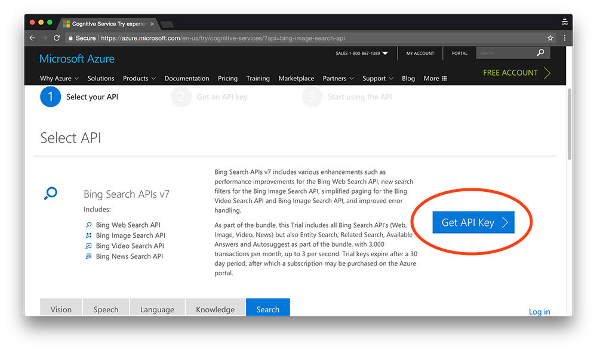
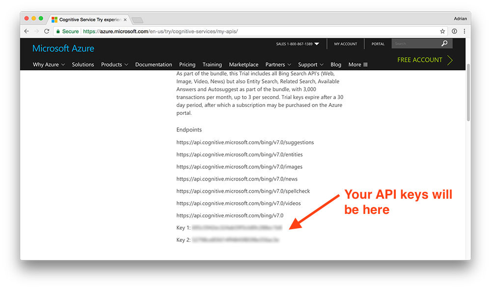

# Fonctionnalité 5: Collecte des données

Nous allons ici collecter des images de visages des personnalités que nous voulons reconnaître sur le web. Pour cela nous allons utiliser des APIs de recherche d'images.

Vous avez vu le concept d'APis dans le cours de SIP mais si quelques révisions sont nécessaires, vous pouvez consultez le cours d'OpenClassRooms sur les [APIs REST](https://openclassrooms.com/fr/courses/3449001-utilisez-des-api-rest-dans-vos-projets-web). La [vidéo](https://www.lewagon.com/fr/blog/api-webhook-debutant-tutoriel) du tutorial de S. Saunier du Wagon est aussi une très bonne introduction pour les débutants.

Ici, nous pouvons utiliser l'API de Bing, la [Bing Image Search](https://azure.microsoft.com/en-us/services/cognitive-services/bing-image-search-api/) ou de manière équivalente l' [API de Google](https://pypi.org/project/Google-Images-Search/).

Ces deux APIs nécessitent la création d'un compte et sont gratuites seulement pour une période limitée.

**ATTENTION, ces APIs nécessitent maintenant de rentrer un moyen de paiement et ce ne sera donc pas la solution retenue pour cette édition !**

Pour collecter des données vous pouvez donc soit :

 * Utiliser une base existante comme par exemple [celui-là](http://vis-www.cs.umass.edu/lfw/#explore)
 * Collecter vos données en mode pseudo-manuel en suivant ce [tutorial](ps://www.pyimagesearch.com/2017/12/04/how-to-create-a-deep-learning-dataset-using-google-images/?_ga=2.255662600.1034048423.1636417226-771132146.1636417226)
 

Le reste est laissé à titre purement informatif.
=========

Nous utiliserons ici l'API de Bing et en cliquant sur le lien ci-dessus, vous pourrez faire les démarches pour pouvoir y accéder.

Après cette étape d'enregistrement, vous pouvez accéder aux cles d'accès aux APis

Vous pouvez maintenant utiliser l'APIs pour collecter des images des personnalités cibles. Pour cela, il est recommandé de lire le petit tutoriel d'introduction à l'API [ici](https://docs.microsoft.com/en-us/azure/cognitive-services/bing-image-search/) et [celui](https://docs.microsoft.com/en-us/azure/cognitive-services/bing-image-search/image-sdk-python-quickstart) spécifique à python.

Vous pouvez dans un premier temps reproduire le code proposé dans ce tutorial et essayez de le comprendre. L'API vous renvoie un ensemble d'URL et il faudra donc prévoir dans votre programme de récupérer les images à partir de leurs URLs et de les écrire sur disque.

Il vous sera pour cela nécessaire d'installer le module `requests` via la commande 

`pip install requests`

Dans le package `imagecollect`, ajouter un module `bing_data_collect` dans lequel vous écrirez les fonctions permettant de rechercher des images d'une personne nommée dans la requête.

Quelques recommandations : 
 + Essayer de rendre ce programme le plus modulaire possible.
 + Prenez bien le temps de regarder les [fonctionnalités de l'API](https://docs.microsoft.com/en-us/rest/api/cognitiveservices-bingsearch/bing-images-api-v7-reference#imagecontent), notamment pour être certains d'avoir en retour des images de visages.

Il vous restera ensuite à orchestrer les differents programmes précédents pour collecter et stocker les images de votre dataset.

Nous avons fini ici cette fonctionnalité. Avant de passer à la fonctionnalité suivante, il vous est demandé de :

+ Ajouter votre fichier à votre dépôt git.
+ Faire un commit
+ Pousser (Push) votre code vers votre dépôt distant sur GitLab. 

Vous pouvez maintenant passer à la [**Fonctionnalité 6** : Détecter un visage](./S3_facedetection.md)

 

