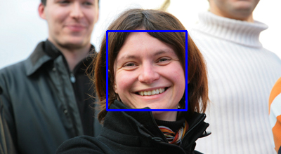

# Fonctionnalité 6 : Détecter un visage

L'objectif de cette fonctionnalité est de pouvoir, étant donnée une image avec une personne, détecter la partie de l'image contenant son visage.

C'est une étape qui peut être faite en faisant appel à des approches d'apprentissage profond et notamment, en utilisant, par exemple, la bibliothèque [`face_recognition`](https://github.com/ageitgey/face_recognition). Cette bibliothèque peut être un peu difficile à installer et nous utiliserons donc OPENCV pour réaliser cette étape.

Cette étape est très clairement expliquée [ici](https://medium.com/@ageitgey/machine-learning-is-fun-part-4-modern-face-recognition-with-deep-learning-c3cffc121d78).

La chaîne de traitement pour détecter des visages dans une image est la suivante :

 + convertir l’image en niveaux de gris ([documentation OpenCV](https://opencv24-python-tutorials.readthedocs.io/en/latest//py_tutorials/py_imgproc/py_colorspaces/py_colorspaces.html))
 + appliquer l’algorithme HOG (Histogram of Oriented Gradients) pour extraire les caractéristiques d'intérêts dans l'image ([documentation OpenCV]()).
 + utiliser l’algorithme Haar Cascade qui s’occupera de trouver les visages

De la documentation est disponible [ici](https://docs.opencv.org/3.0-beta/doc/py_tutorials/py_objdetect/py_face_detection/py_face_detection.html). Vous pouvez aussi, par exemple, vous inspirer de cette [approche](https://towardsdatascience.com/face-detection-in-2-minutes-using-opencv-python-90f89d7c0f81).

L'image ci-dessous donne un exemple de détection obtenue sur une image de C. Hudelot.

Il vous faudra dans votre cas faire un crop de l'image selon la zone détectée. C'est à partir de cette imagette que sera fait la reconnaissance.

Ajouter un module `facedetection` à votre projet et écrire les fonctions nécessaires à la détection des visages dans une image. Tester cette fonctionnalité sur des images de votre base pour évaluer la qualité de la détection. 

+ Ajouter votre fichier à votre dépôt git.
+ Faire un commit
+ Pousser (Push) votre code vers votre dépôt distant sur GitLab. 

Vous pouvez maintenant passer à la [**Fonctionnalité 7** : Description des données](./S3_facedescription.md)
