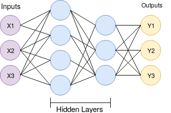
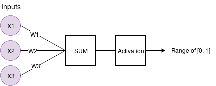

# Introduction to Deep Learning with Keras

During the rest of the week, we'll need to find some balance between treating neural networks as a total black box, and having a some understanding of the main details. After all, this is just an introduction, if you find the material we've presented thus far interesting, you can always acquire a (deeper) understanding on your own.

### Optional reading:
As a first step, take some time and read the two following summaries of some basic concepts in deep learning:
  - [Logistic Regression &  Neural Networks](notes/logistic_regression.pdf)
  - [Deep Learning Methods](notes/DL_methods.pdf)

## Preliminaries

Let's show a typical model:

<p align="center"></p>

A basic neural network consists of an input layer, which is just our data in numerical form. After the input layer, we will have some number of what are called "hidden" layers. A hidden layer is just an intermediate layers in between the input and output layers. One hidden layer means we just have a neural network. Two or more hidden layers? we've got a deep neural network, simple as that.

Why is this? Well, if we have a single hidden layer, the model is going to only learn linear relationships. But with many hidden layers, we can begin to learn non-linear relationships between the inputs and outputs.

A single neuron might look as follows:

<p align="center"></p>

The idea of a single neuron is just a summation of all of the inputs x weights, fed through some sort of activation function. The activation function is meant to simulate a neuron firing or not. A simple example would be a stepper function, where, at some point, the threshold is crossed, and the neuron fires a 1, else a 0. Let's say that neuron is in the first hidden layer, and it's going to communicate with the next hidden layer. So it's going to send it's 0 or a 1 signal, multiplied by the weights, to the next neuron, and this is the process for all neurons and all layers.

The mathematical challenge for the artificial neural network is to best optimize thousands or millions or whatever number of weights we have, so that the output layer results in what we were hoping for. Solving for this problem, and building out the layers of our neural network model is exactly what a deep learning framework is for. These frameworks are used for all things "operations on tensors." A tensor in this case is just a multi-dimensional array.

To install TensorFlow, simply do a `pip install` (remember, we're still using the virutalenv `codingweeks`), 

```shell
pip install tensorflow
```

For Windows users, if you get an error add run `python -m pip install tensorflow --user`.

Following the release of deep learning libraries like TensorFlow, Pytorch, MXNET, Chainer, etc. Higher-level API-like libraries came out, which sit on top of these deep learning libraries, like Keras which is build on top of TensorFlow and FastAi which on top of PyTorch, these higher-level libraries make building, testing, and tweaking models even more simple. 

Keras has become so popular, that it is now a superset, included with TensorFlow releases now. Instead of installing the Keras separately  library, we can simply use `tensorflow.keras` to call it. Let's import `keras` and `tensorflow`:

```python
import tensorflow.keras as keras
import tensorflow as tf
```

### Training data

Once we've got imported the necessary packages, we can then begin to prepare our data, model it, and then train on it. For the sake of simplicity, we'll be using the most common "hello world" example for deep learning, which is the mnist dataset. It's a dataset of hand-written digits, 0 through 9. It's 28 x 28 images of these hand-written digits. We will show an example of using outside data as well, but, for now, let's load in this data:

```python
mnist = keras.datasets.mnist
(x_train, y_train),(x_test, y_test) = mnist.load_data()
```

When we're working with our own collected data, chances are, it won't be packaged up so nicely, and we'll spend a bit more time (actually, most of the time) and effort on this step. But, for in this instance, the preparation of training data is quite straight forward.

So what exactly do we have here? Let's take a quick peak.

So the `x_train` data is the "features". In this case, the features are pixel values of the 28x28 images of these digits 0-9. The `y_train` is the label (The digit in the image, in the range of [0, 9])

The testing variants of these variables is the "out of sample" examples that we will use. These are examples from our data that we're going to set aside, reserving them for testing the model.

Neural networks are exceptionally good at fitting to data, so much so that they will commonly over-fit the data. Our real hope is that the neural network doesn't just memorize our data and that it instead "generalizes" and learns the actual problem and patterns associated with it.

Let's look at this actual data:

```python
print(x_train[0])
```

It's a simple two dimensional array representing the pixel values of the input images.  Alright, if it is an image, let's visualize it, but first let's install `matplotlib`:

```bash
pip install matplotlib
```

And then plot some images from the training set:

```python
import matplotlib.pyplot as plt

plt.imshow(x_train[0],cmap=plt.cm.binary)
plt.show()
```

Now, let's make sure the label is indeed the digit we've seen in the image above:

```python
print(y_train[0])
```

### Preprocessing

It's generally a good idea to "normalize" the training data. This typically involves scaling the data to be between 0 and 1 (like our case), or maybe -1 and positive 1. In our case, each "pixel" is a feature, and each feature encoded in an 8 bit color range, going from 0 to 255. Not quite 0 to 1. Let's change that with a handy utility function:

```python
x_train = keras.utils.normalize(x_train, axis=1)
x_test = keras.utils.normalize(x_test, axis=1)
```

Now print some of the inputs and make sure they were normalized. You can also plot some images.

### The model & training

Now let's build our model:

```python
model = keras.models.Sequential()
```

A sequential model is what you're going to use most of the time. It just means things are going to go in direct order, a feed forward model.

Now, we'll add some layers to our model. Recall that in an simple feed-forward neural network (as the one in the Figure above) takes as inputs one dimensional array (vectors), but our inputs are two dimensional array (matrix form). So, we first need to take the 28x28 image, and make it a flat 1x784. There are many ways for us to do this, but Keras has a Flatten layer built just for us, so we'll use that.

```python
model.add(keras.layers.Flatten())
```

This will serve as our input layer, it won't do any computation that is related to the neural network, it will simply flatten the inputs. Next, we want our hidden layers. We're going to go with the simplest neural network layer, which is just a Dense layer. This refers to the fact that it's a densely-connected layer, meaning it's "fully connected", where each node connects to each prior and subsequent node.

```python
model.add(keras.layers.Dense(128, activation='relu'))
```

This layer has 128 units. The activation function is `relu`, short for rectified linear. Currently, relu is the activation function we default to. There are many more to test for sure, but, that's for another time.

Let's add another identical layer just like the example above, with the same number of hidden units.

```python
model.add(keras.layers.Dense(128, activation='relu'))
```
Now we're going to finish with the output layer:

```python
model.add(keras.layers.Dense(10, activation='softmax'))
```

This is our final layer. It has 10 nodes. 1 node per possible number prediction. In this case, our activation function is a softmax function, since we're really actually looking for something more like a probability distribution of which each output element will be in the range of [0, 1], and all of the outputs sum to 1. 

Now we need to "compile" the model. This is where we pass the settings for actually optimizing/training the model we've defined.

```python
model.compile(optimizer='adam',
              loss='sparse_categorical_crossentropy',
              metrics=['accuracy'])
```

Such as we picked relu. Here we'll use the Adam optimizer. It's just a great default to start with. For the curious, you can read this [section](http://cs231n.github.io/neural-networks-3/#update) of the CS231 course on optimization methods in DL.

Next, we have our loss metric. Loss is a calculation of error. A neural network doesn't actually attempt to maximize accuracy. It attempts to minimize loss. Again, there are many choices, but some form of categorical cross-entropy is a good start for a classification task like this.

Now, we fit our model on the training data, here we fit the model for three epochs, meaning we'll do through each example in the dataset three times.

```
model.fit(x_train, y_train, epochs=3)
```

As we train, we can see loss goes down, and accuracy improves quite quickly to 98-99%.

Now that's loss and accuracy for in-sample data. Getting a high accuracy and low loss might mean the model learned how to classify digits in general (it generalized), but also might simply be due to the fact that the model memorized every single example we showed it (it overfit). This is why we need to test on out-of-sample data (data we didn't use to train the model).

### Testing

Let's see the error rate and accuracy on the test data:

```python
val_loss, val_acc = model.evaluate(x_test, y_test)
print(f'Validation loss: {val_acc}, Validation accuracy: {val_acc}')
```

It's going to be very likely that the accuracy out of sample examples is a bit worse, same with loss.


**Your turn:** Try training the model for more epochs and see what is the maximal validation accuracy you can get, also try adding some additional layers and different number of units per layers (except the output layers), and see how that affects the training speed and the accuracy.


Finally, with a trained model, we can save it super easily:

```python
model.save('first_model_of_many_to_come.model')
```

And load it back:

```
new_model = keras.models.load_model('first_model_of_many_to_come.model')
```

### Predictions

Using the training model, take some examples from the dataset, and call predict and print the results and also the inputs image, and see if the prediction is correct (use `model.predict()`).

### Next

With this short intro to Deep Leaning and Keras, let's go big and go back to our [functionality](S3_facedescription.md)